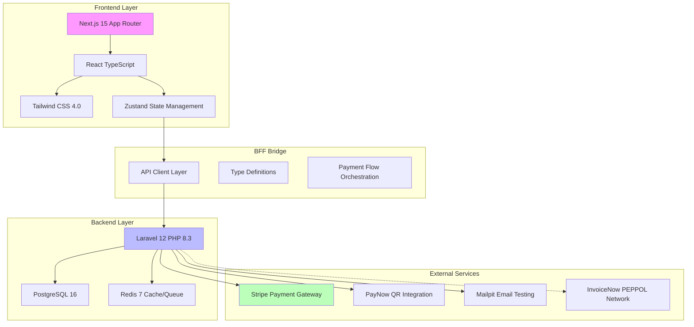

# Project Architecture Document
## Morning Brew Collective - Single Source of Truth

**Project:** Morning Brew Collective - Singapore Kopitiam E-commerce Platform
**Created:** January 20, 2026
**Version:** 1.1 (Phase 8 Update)
**Maintained By:** Frontend Architect & Development Team

---

## Table of Contents

1. [System Overview](#system-overview)
2. [File Hierarchy](#file-hierarchy)
3. [Database ERD](#database-erd)
4. [Order Flow](#order-flow)
5. [Design Architecture](#design-architecture)
6. [Onboarding Guide](#onboarding-guide)
7. [PR Checklist](#pr-checklist)
8. [Development Commands](#development-commands)
9. [Critical Technical Decisions](#critical-technical-decisions)

---

## System Overview

### BFF (Backend-for-Frontend) Architecture



### Architecture Pattern: API-First Monorepo

```
/root
├── frontend/           # Next.js 15 React Application
│   ├── src/app/        # App Router (Route Groups: (shop), (dashboard))
│   ├── src/components/ # React Components
│   ├── src/store/      # Zustand State Stores
│   └── src/types/      # TypeScript Type Definitions
│
└── backend/            # Laravel 12 API Backend
    ├── app/            # Application Logic
    │   ├── Http/       # Controllers & Resources
    │   ├── Models/     # Eloquent Models
    │   ├── Services/   # Business Logic Layer
    │   └── Providers/    # Service Providers
    ├── database/       # Migrations & Factories
    ├── routes/         # API Routes
    └── tests/          # PHPUnit Tests
```

---

## File Hierarchy

### Root Directory Structure

```
authentic-kopitiam/
├── backend/                        # Laravel 12 API Backend
│   ├── app/
│   │   ├── Http/
│   │   │   ├── Controllers/
│   │   │   │   ├── Api/
│   │   │   │   │   ├── OrderController.php
│   │   │   │   │   ├── PaymentController.php
│   │   │   │   │   ├── InvoiceController.php       # InvoiceNow XML Download
│   │   │   │   │   └── ...
│   │   │   ├── Middleware/
│   │   │   │   └── VerifyOrderOwnership.php
│   │   ├── Models/
│   │   │   ├── Order.php
│   │   │   ├── Payment.php
│   │   │   └── ...
│   │   ├── Services/
│   │   │   ├── PaymentService.php          # Payment Orchestration
│   │   │   ├── InvoiceService.php          # PEPPOL UBL 2.1 Generator
│   │   │   ├── InventoryService.php        # Redis Inventory Locks
│   │   │   └── ...
│
├── frontend/                           # Next.js 15 React Frontend
│   ├── src/
│   │   ├── app/                        # Next.js App Router
│   │   │   ├── (shop)/                 # Public Shop Routes
│   │   │   │   ├── layout.tsx
│   │   │   │   ├── page.tsx
│   │   │   │   └── ...
│   │   │   ├── (dashboard)/            # Admin Dashboard Routes
│   │   │   │   ├── layout.tsx
│   │   │   │   ├── admin/
│   │   │   │   │   ├── page.tsx        # Dashboard Home
│   │   │   │   │   ├── orders/         # Order Management
│   │   │   │   │   └── inventory/      # Inventory Control
│   │   │
│   │   ├── components/
│   │   │   ├── admin/                  # Admin-specific Components
│   │   │   │   ├── sidebar.tsx
│   │   │   │   ├── header.tsx
│   │   │   │   └── orders-table.tsx
│   │   │   ├── ui/                     # Shared UI Components
│   │   │   │   ├── retro-button.tsx
│   │   │   │   └── ...
│   │   ├── styles/                     # Design System
│   │   │   ├── tokens.css              # Design Tokens
│   │   │   ├── admin.css               # Admin Ledger Styles
│   │   │   └── ...
```

### Key Backend Files & Descriptions

#### Services (`backend/app/Services/`)

| File | Responsibilities | Key Methods |
|------|------------------|-------------|
| `PaymentService.php` | Payment orchestration | `processPayment`, `verifyWebhook` |
| `InvoiceService.php` | PEPPOL UBL 2.1 XML generation | `generateUblXml` |
| `InventoryService.php` | Redis inventory locks | `reserve`, `commit`, `rollback` |

### Key Frontend Files & Descriptions

#### Pages (`frontend/src/app/`)

| Route Group | Path | Purpose |
|-------------|------|---------|
| `(shop)` | `/` | Public landing page and shop |
| `(shop)` | `/checkout` | Customer checkout flow |
| `(dashboard)` | `/admin` | Admin dashboard overview |
| `(dashboard)` | `/admin/orders` | Order management list |
| `(dashboard)` | `/admin/orders/[id]` | Order details and invoicing |

---

## Critical Technical Decisions

### Decision 8: Route Groups for Layout Isolation

**Context:** The Admin Dashboard needs a completely different layout (sidebar, dense data) from the public shop (visual, spacious header/footer).

**Decision:**
Use Next.js Route Groups `(shop)` and `(dashboard)` to enforce distinct `layout.tsx` files.

**Impact:**
- ✅ Clean separation of concerns.
- ✅ No layout leakage (e.g., public footer appearing in admin).
- ✅ Optimized asset loading per section.

**File Structure:**
```
src/app/
├── (shop)/
│   ├── layout.tsx  # <Header /> <Footer />
│   └── page.tsx
├── (dashboard)/
│   ├── layout.tsx  # <Sidebar /> <AdminHeader />
│   └── admin/
```

---

### Decision 9: InvoiceNow (PEPPOL) Compliance

**Context:** Singapore B2B transactions require InvoiceNow readiness.

**Decision:**
Implement native PHP XML generation using `DOMDocument` to create valid PEPPOL BIS Billing 3.0 (UBL 2.1) files.

**Technical Implementation:**
- **Namespace:** `urn:oasis:names:specification:ubl:schema:xsd:Invoice-2`
- **CustomizationID:** `urn:cen.eu:en16931:2017#compliant#urn:fdc:peppol.eu:2017:poacc:billing:3.0:singapore:1.0.0`
- **Tax Scheme:** `GST` with category code `S` (Standard Rated).
- **Precision:** XML amounts formatted to 2 decimal places, unit prices to 4.

---

**This document is the single source of truth for the Morning Brew Collective project architecture.**

**Document Location:** `/Project_Architecture_Document.md` (root directory)