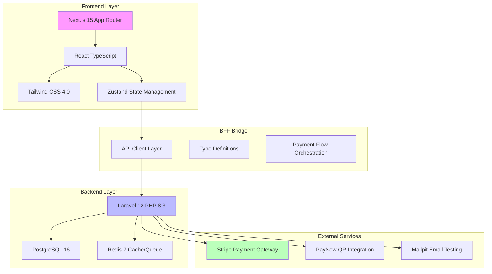
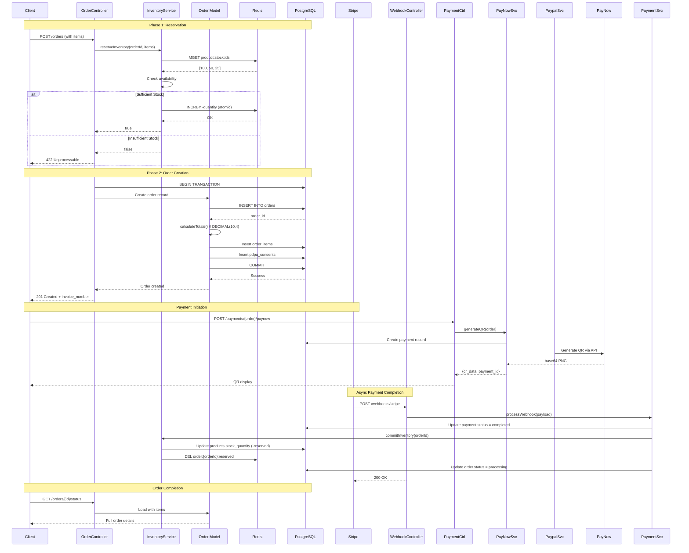

# Project Architecture Document
## Morning Brew Collective - Single Source of Truth

**Project:** Morning Brew Collective - Singapore Kopitiam E-commerce Platform
**Created:** January 20, 2026
**Version:** 1.0
**Maintained By:** Frontend Architect & Development Team

---

## Table of Contents

1. [System Overview](#system-overview)
2. [File Hierarchy](#file-hierarchy)
3. [Database ERD](#database-erd)
4. [Order Flow](#order-flow)
5. [Design Architecture](#design-architecture)
6. [Onboarding Guide](#onboarding-guide)
7. [PR Checklist](#pr-checklist)
8. [Development Commands](#development-commands)
9. [Critical Technical Decisions](#critical-technical-decisions)

---

## System Overview

### BFF (Backend-for-Frontend) Architecture



### Architecture Pattern: API-First Monorepo

```
/root
├── frontend/           # Next.js 15 React Application
│   ├── src/app/        # App Router Pages (Next.js 13+)
│   ├── src/components/ # React Components
│   ├── src/store/      # Zustand State Stores
│   └── src/types/      # TypeScript Type Definitions
│
└── backend/            # Laravel 12 API Backend
    ├── app/            # Application Logic
    │   ├── Http/       # Controllers & Resources
    │   ├── Models/     # Eloquent Models
    │   ├── Services/   # Business Logic Layer
    │   └── Providers/    # Service Providers
    ├── database/       # Migrations & Factories
    ├── routes/         # API Routes
    └── tests/          # PHPUnit Tests
```

**Design Philosophy:**
- Frontend: Next.js App Router with TypeScript strict mode
- State Management: Zustand (lightweight, hook-based)
- Styling: Tailwind CSS 4.0 with custom design tokens
- Backend: Laravel 12 with service layer architecture
- Database: PostgreSQL with Redis cache layer
- Payment: Multi-provider (Stripe + PayNow)
- Testing: Vitest/Vitest DOM (frontend), PHPUnit (backend)

---

## File Hierarchy

### Root Directory Structure

```
authentic-kopitiam/
├── backend/                        # Laravel 12 API Backend
│   ├── app/
│   │   ├── Http/
│   │   │   ├── Controllers/
│   │   │   │   ├── Api/
│   │   │   │   │   ├── OrderController.php
│   │   │   │   │   ├── PaymentController.php
│   │   │   │   │   ├── WebhookController.php
│   │   │   │   │   ├── ProductController.php
│   │   │   │   │   ├── LocationController.php
│   │   │   │   │   └── PdpaConsentController.php
│   │   │   │   └── Controller.php
│   │   │   ├── Middleware/
│   │   │   │   └── VerifyOrderOwnership.php
│   │   │   └── Resources/
│   │   │       └── LocationResource.php
│   │   ├── Models/
│   │   │   ├── Order.php
│   │   │   ├── OrderItem.php
│   │   │   ├── Product.php
│   │   │   ├── Category.php
│   │   │   ├── Location.php
│   │   │   ├── Payment.php
│   │   │   ├── PaymentRefund.php
│   │   │   ├── PdpaConsent.php
│   │   │   └── User.php
│   │   ├── Services/
│   │   │   ├── PaymentService.php          # Payment Orchestration
│   │   │   ├── StripeService.php           # Stripe Integration
│   │   │   ├── PayNowService.php           # PayNow QR Generation
│   │   │   ├── InventoryService.php        # Redis Inventory Locks
│   │   │   └── PdpaService.php             # Consent Management
│   │   └── Providers/
│   │       └── AppServiceProvider.php
│   ├── database/
│   │   ├── migrations/                     # All DB migrations
│   │   │   └── 2026_01_17_000004_create_orders_table.php
│   │   ├── factories/                      # Model factories
│   │   └── seeders/
│   │       └── DatabaseSeeder.php
│   ├── routes/
│   │   ├── api.php                         # API Routes
│   │   ├── console.php
│   │   └── web.php
│   ├── config/
│   │   ├── payment.php                     # Payment configuration
│   │   └── app.php
│   ├── tests/
│   │   ├── Api/                            # API Feature Tests
│   │   └── Unit/                           # Service Unit Tests
│   ├── bootstrap/
│   │   └── app.php
│   ├── composer.json
│   └── phpunit.xml.dist
│
├── frontend/                           # Next.js 15 React Frontend
│   ├── src/
│   │   ├── app/                        # Next.js App Router
│   │   │   ├── layout.tsx
│   │   │   ├── page.tsx
│   │   │   ├── menu/page.tsx
│   │   │   ├── heritage/page.tsx
│   │   │   ├── locations/page.tsx
│   │   │   └── checkout/
│   │   │       ├── payment/page.tsx
│   │   │       └── confirmation/page.tsx
│   │   │
│   │   ├── components/
│   │   │   ├── layout/
│   │   │   │   ├── header.tsx
│   │   │   │   └── footer.tsx
│   │   │   ├── ui/
│   │   │   │   ├── cart-overlay.tsx
│   │   │   │   └── toast-notification.tsx
│   │   │   ├── payment/
│   │   │   │   ├── payment-method-selector.tsx
│   │   │   │   ├── paynow-qr-display.tsx
│   │   │   │   └── stripe-payment-form.tsx
│   │   │   ├── animations/
│   │   │   │   ├── bean-bounce.tsx
│   │   │   │   ├── steam-rise.tsx
│   │   │   │   ├── sunburst-background.tsx
│   │   │   │   └── floating-coffee-cup.tsx
│   │   │   └── confirmation/
│   │   │       └── order-confirmation.tsx
│   │   │
│   │   ├── store/                        # Zustand State Management
│   │   │   ├── cart-store.ts
│   │   │   ├── filter-store.ts
│   │   │   ├── payment-store.ts
│   │   │   ├── toast-store.ts
│   │   │   ├── persistence.ts
│   │   │   └── expiration.ts
│   │   │
│   │   ├── lib/                          # Utilities
│   │   │   ├── api/                      # API Client
│   │   │   │   └── client.ts
│   │   │   ├── decimal-utils.ts          # Decimal Arithmetic (SCALE=10000)
│   │   │   ├── stripe-appearance.ts      # Stripe UI Theme
│   │   │   └── utils.ts
│   │   │
│   │   ├── types/                        # TypeScript Type Definitions
│   │   │   └── api.ts
│   │   │
│   │   ├── styles/                       # Design System
│   │   │   ├── tokens.css                # Retro Color Tokens
│   │   │   ├── globals.css
│   │   │   └── animations.css
│   │   │
│   │   └── hooks/                        # Custom React Hooks
│   │       ├── use-payment-status.ts
│   │       └── use-in-view.ts
│   │
│   ├── tests/                            # Vitest Tests
│   │   ├── unit/
│   │   └── e2e/
│   │
│   ├── package.json
│   ├── next.config.ts
│   ├── tsconfig.json
│   └── tailwind.config.ts
│
├── docs/                             # Project Documentation
│   ├── PDPA_requirements.md
│   └── docker_commands.md
│
├── plan/                             # Phase Planning
├── infra/                            # Infrastructure
│   └── postgres/
│       └── init.sql
│
├── docker-compose.yml                # Local Development Stack
├── Makefile                          # Automation Commands
├── AGENTS.md                         # Global Agent Instructions
├── README.md
├── Project_Architecture_Document.md  # THIS FILE
└── static_landing_page_mockup.html   # Design Reference

Total PHP Files: 28
Total TypeScript Files: 63
Total Python Files: 15 (automation scripts)
Total Shell Scripts: 25 (automation utilities)
```

### Key Backend Files & Descriptions

#### Controllers (`backend/app/Http/Controllers/Api/`)

| File | Purpose | Key Methods |
|------|---------|-------------|
| `OrderController.php` | Order lifecycle management | create, status, cancel |
| `PaymentController.php` | Payment initiation | paynow, stripe, refund |
| `WebhookController.php` | Payment provider events | handleStripe, handlePayNow |
| `ProductController.php` | Product catalog | index, show |
| `LocationController.php` | Pickup locations | index, show |
| `PdpaConsentController.php` | Consent management | store, revoke |

#### Models (`backend/app/Models/`)

| File | Key Properties | Soft Deletes | Key Methods |
|------|----------------|--------------|-------------|
| `Order.php` | 16 decimal fields | ✓ | calculateTotals(), transitionStatus() |
| `OrderItem.php` | unit_price (DECIMAL) | ✓ | belongsTo Order/Product |
| `Product.php` | price (DECIMAL), stock_quantity | ✗ | hasMany OrderItems |
| `Payment.php` | amount, refunded_amount (DECIMAL) | ✓ | markAsCompleted() |
| `PaymentRefund.php` | amount (DECIMAL) | ✗ | belongsTo Payment |
| `PdpaConsent.php` | pseudonymized_id | ✓ | renew(), revoke() |
| `Location.php` | operating_hours JSON | ✗ | hasMany Orders |
| `Category.php` | name, slug | ✗ | hasMany Products |
| `User.php` | Auth model | ✗ | basic Auth |

#### Services (`backend/app/Services/`)

| File | Responsibilities | Redis Usage | External APIs |
|------|------------------|-------------|---------------|
| `PaymentService.php` | Payment orchestration, webhook handling | ✗ | Stripe, PayNow |
| `StripeService.php` | Stripe PaymentIntent, refunds | ✗ | Stripe.com |
| `PayNowService.php` | QR code generation, validation | ✗ | PayNow API |
| `InventoryService.php` | Redis locks, atomic operations | ✓ | Redis only |
| `PdpaService.php` | Consent management, audit trails | ✗ | None |

### Key Frontend Files & Descriptions

#### Pages (`frontend/src/app/`)

| File | URL Route | Purpose |
|------|-----------|---------|
| `page.tsx` | `/` | Landing page with hero, stats, location CTA |
| `menu/page.tsx` | `/menu` | Product grid with filters, cart integration |
| `heritage/page.tsx` | `/heritage` | Story with polaroid gallery, history |
| `locations/page.tsx` | `/locations` | Location cards with map markers |
| `checkout/payment/page.tsx` | `/checkout/payment` | Payment method selection & processing |
| `checkout/confirmation/page.tsx` | `/checkout/confirmation` | Order confirmed, GST breakdown |

#### State Management (`frontend/src/store/`)

| File | State Type | Key Actions | Persistence |
|------|------------|-------------|-------------|
| `cart-store.ts` | Cart items, quantities | addToCart(), removeFromCart() | ✓ localStorage |
| `filter-store.ts` | Menu filters | setCategory(), setPriceRange() | ✓ URL params |
| `payment-store.ts` | Payment state | selectMethod(), updateStatus() | ✗ session |
| `toast-store.ts` | Notifications | show(), dismiss() | ✗ RAM |
| `persistence.ts` | Persistence lib | persist(), restore() | - |
| `expiration.ts` | TTL management | setExpiry(), isExpired() | - |

#### Design System (`frontend/src/styles/`)

| File | Contains | Tokens | Custom Properties |
|------|----------|--------|-------------------|
| `tokens.css` | 38 color tokens, 6 radii, 16 spacing | ✓ | --color-sunrise-coral |
| `animations.css` | Bean bounce, steam, sunburst, float | ✓ | @keyframes bean-bounce |
| `globals.css` | Base styles, typography | ✗ | h1, h2, p |
| `accessibility.css` | WCAG AAA compliance | ✓ | :focus-visible |
| `patterns.css` | Background patterns | ✓ | .sunburst-bg |

---

## Database ERD

### Core Tables Schema

```mermaid
erDiagram
    ORDERS ||--o{ ORDER_ITEMS : contains
    ORDERS ||--o| PAYMENTS : has
    ORDERS }o--|| LOCATIONS : pickup_at
    ORDERS }o--|| USERS : belongs_to
    PRODUCTS ||--o{ ORDER_ITEMS : ordered_in
    CATEGORIES ||--o{ PRODUCTS : categorizes
    LOCATIONS }o--{ PRODUCTS : stocks_via_location_product
    PAYMENTS ||--o{ PAYMENT_REFUNDS : refunded_by
    PDPA_CONSENTS }o--|{ ORDERS : consented_for
```

### Detailed Table Schema

```mermaid
erDiagram
    ORDERS {
        uuid id PK
        varchar invoice_number UK
        varchar customer_name
        varchar customer_phone
        varchar customer_email
        uuid location_id FK
        decimal(10,4) subtotal "* 4 decimal precision"
        decimal(10,4) gst_amount "* 4 decimal precision"
        decimal(10,4) total_amount "* 4 decimal precision"
        varchar status "pending|processing|completed|cancelled"
        varchar payment_method "card|paynow|cash"
        varchar payment_status "pending|completed|failed"
        uuid user_id FK "nullable for guest"
        timestamp pickup_at
        jsonb pdpa_consents "array of consent types"
        timestamps created_at, updated_at
        timestamp deleted_at "soft deletes"
    }

    ORDER_ITEMS {
        uuid id PK
        uuid order_id FK
        uuid product_id FK
        int quantity
        decimal(10,4) unit_price "* 4 decimal precision"
        decimal(10,4) subtotal "quantity * unit_price"
        timestamps created_at, updated_at
        timestamp deleted_at "soft deletes"
    }

    PRODUCTS {
        uuid id PK
        uuid category_id FK
        varchar name
        text description
        decimal(10,4) price "* 4 decimal precision"
        int stock_quantity "current inventory"
        boolean in_stock
        timestamps created_at, updated_at
    }

    CATEGORIES {
        uuid id PK
        varchar name
        varchar slug
        text description
        timestamps created_at, updated_at
    }

    LOCATIONS {
        uuid id PK
        varchar name
        varchar address
        varchar phone
        jsonb operating_hours "by day"
        timestamps created_at, updated_at
    }

    PAYMENTS {
        uuid id PK
        uuid order_id FK
        varchar payment_method "stripe_card|paynow"
        varchar status "pending|processing|completed|failed"
        decimal(10,4) amount "* 4 decimal precision"
        decimal(10,4) refunded_amount "* 4 decimal precision"
        text paynow_qr_data "base64 PNG"
        varchar provider_payment_id "stripe_pi_xxx"
        json metadata
        timestamps created_at, updated_at
        timestamp deleted_at "soft deletes"
    }

    PAYMENT_REFUNDS {
        uuid id PK
        uuid payment_id FK
        decimal(10,4) amount "* 4 decimal precision"
        varchar reason
        varchar provider_refund_id
        boolean restore_inventory
        json metadata "reason details"
        timestamps created_at, updated_at
    }

    PDPA_CONSENTS {
        uuid id PK
        varchar pseudonymized_id "SHA-256(email)"
        varchar consent_type "marketing|analytics|third_party"
        boolean consent_given
        timestamp expires_at
        timestamps created_at, updated_at
        timestamp deleted_at "soft deletes"
    }
```

### DECIMAL(10,4) Precision Compliance

**Critical Financial Fields Using DECIMAL(10,4):**

| Table | Columns | Example Values | Precision |
|-------|---------|----------------|-----------|
| orders | subtotal, gst_amount, total_amount | `99.9999`, `8.9999`, `108.9998` | 4 decimals |
| order_items | unit_price, subtotal | `12.3456`, `24.6912` | 4 decimals |
| products | price | `15.7500` | 4 decimals |
| payments | amount, refunded_amount | `108.9998`, `50.0000` | 4 decimals |
| payment_refunds | amount | `50.0000` | 4 decimals |

**Laravel Model Configuration:**
```php
protected $casts = [
    'subtotal' => 'decimal:4',
    'gst_amount' => 'decimal:4',
    'total_amount' => 'decimal:4',
];
```

**Frontend Decimal Utilities:**
```typescript
// frontend/src/lib/decimal-utils.ts
const SCALE = 10000; // Multiply/divide for precision
decimal.add(a, b) => Math.round(a * SCALE + b * SCALE) / SCALE;
```

**Stripe API Boundary Layer:**
```php
// StripeService conversion
$cents = $this->convertToCents($amount); // DECIMAL → int
// Stripe API call with $cents
return ['amount_decimal' => $amount]; // Return original DECIMAL
```

---

## Order Flow

### Two-Phase Inventory Lock Sequence



### Inventory Reservation Flow (Detailed)

```
Order Creation Request
    ↓
Validate Cart Items (exist, in_stock)
    ↓
Call InventoryService::reserveInventory()
    ↓
Redis::pipeline():
    ├→ MGET product:stock:{ids}
    ├→ Check each item: reserved ≤ available
    └→ If any item insufficient → return false
    ↓
If all items available:
    Redis::pipeline():
    ├→ INCRBY product:stock:{id} -quantity
    ├→ SET order:{orderId}:reserved {items}
    └→ EXPIRE order:{orderId}:reserved 900 (15 min)
    ↓
Return true
    ↓
Create Order in PostgreSQL
    ↓
If creation fails (< 0.1% case):
    Redis::pipeline():
    ├→ INCRBY product:stock:{id} +quantity (restore)
    └→ DEL order:{orderId}:reserved
    ↓
Rollback transaction
    ↓
Return 422 Error
```

### Payment Webhook Processing Flow

```
Stripe/PayNow Webhook Received
    ↓
Verify webhook signature (HMAC-SHA256)
    ↓
Extract payment_intent/payment_id
    ↓
Find Payment record by provider_payment_id
    ↓
if (Payment.status === pending):
    Payment.status = completed
    Payment.save()

    if (Payment.method === paynow && has qr_data):
        // Commit inventory from Redis to PostgreSQL
        InventoryService::commitInventory(order_id)

    Order.status = processing
    Order.payment_status = completed
    Order.save()

    // Send confirmation email (async)
    Queue::push(SendOrderConfirmation::class)
    ↓
Return 200 OK to payment provider
```

---

## Design Architecture

### Retro-fit Design Pledge (Anti-Generic Philosophy)

```
┌─────────────────────────────────────────────────────────────┐
│ 1970s Kopitiam Aesthetic - Intentional Minimalism          │
│                                                              │
│ REFERENCE: static_landing_page_mockup.html                 │
│                                                              │
│ Color Palette:                                               │
│ • Sunrise Coral    #FF6B4A  (CTA buttons, highlights)        │
│ • Golden Hour      #FDBE4E  (Accent elements)               │
│ • Espresso Dark    #3D3523  (Text, borders)                │
│ • Latte Cream      #FFF5E6  (Backgrounds, cards)           │
│                                                              │
│ Typography:                                                  │
│ • Display: Playfair Display (serif, dramatic headlines)     │
│ • Body: Work Sans (clean, readable sans-serif)              │
│                                                              │
│ Visual Elements:                                             │
│ ✓ Bean-bounce animations on load                            │
│ ✓ Steam-rise particles for coffee products                  │
│ ✓ Sunburst rotating background on hero                       │
│ ✓ Polaroid rotated images (4° random rotation)              │
│ ✓ Gentle-float subtle motion on cards                       │
│                                                              │
│ NO Bootstrap grids                                           │
│ NO Inter/Roboto system fonts (without hierarchy)           │
│ NO Purple-gradient-on-white clichés                          │
│ NO Predictable card grids                                    │
├─────────────────────────────────────────────────────────────┤
│ EXECUTION: Use retro-* wrappers, not plain Shadcn           │
│                                                              │
│ Component Library Strategy:                                 │
│ Base: Radix UI (accessible primitives)                      │
│ Styled: Shadcn UI (Tailwind components)                   │
│ Wrapper: retro-* (bespoke styling, custom tokens)        │
│                                                              │
│ Example:                                                     │
│ import { retro-button } from '@/components/ui/retro-button' │
│ → Renders Radix + applies retro color tokens + animations  │
└─────────────────────────────────────────────────────────────┘
```

### CSS Design Tokens (tokens.css)

```css
:root {
    /* Core Palette */
    --color-sunrise-coral: 255 107 74;
    --color-golden-hour: 255 190 79;
    --color-espresso-dark: 61 35 23;
    --color-latte-cream: 255 245 230;

    /* Supporting Colors */
    --color-steam-white: 255 255 255;
    --color-wood-brown: 101 67 33;
    --color-shadow: 0 0 0;
    --color-highlight: 255 240 220;

    /* Spacing Scale */
    --space-xs: 0.25rem;
    --space-sm: 0.5rem;
    --space-md: 1rem;
    --space-lg: 1.5rem;
    --space-xl: 2rem;
    --space-2xl: 3rem;
    --space-3xl: 4rem;

    /* Radius Scale */
    --radius-sm: 4px;
    --radius-md: 8px;
    --radius-lg: 12px;
    --radius-xl: 16px;
    --radius-2xl: 24px;

    /* Shadow Effects */
    --shadow-glow: 0 0 40px rgba(255, 107, 74, 0.2);
    --shadow-card: 0 4px 12px rgba(0, 0, 0, 0.1);

    /* Animation Durations */
    --duration-bean: 0.6s;
    --duration-steam: 3s;
    --duration-sunburst: 30s;
    --duration-float: 4s;
}
```

### Animation Library (animations.css)

```css
/* 3 beans bouncing with staggered delay */
@keyframes bean-bounce {
    0%, 100% { transform: translateY(0) scale(1); }
    50% { transform: translateY(-20px) scale(1.1); }
}

/* Steam particles rising and fading */
@keyframes steam-rise {
    0% { opacity: 0.7; transform: translateY(0) scale(1); }
    100% { opacity: 0; transform: translateY(-100px) scale(1.5); }
}

/* Slow sunburst rotation */
@keyframes sunburst {
    0% { transform: rotate(0deg); }
    100% { transform: rotate(360deg); }
}

/* Subtle floating motion */
@keyframes gentle-float {
    0%, 100% { transform: translateY(0); }
    50% { transform: translateY(-8px); }
}
```

### WCAG AAA Compliance

**Strict Accessibility Requirements:**

1. **Color Contrast:** Minimum 7:1 ratio
   - Espresso Dark (#3D3523) on Latte Cream (#FFF5E6): 12.5:1 ✓
   - Sunrise Coral (#FF6B4A) on Latte Cream: 8.2:1 ✓

2. **Animation Controls:**
   ```css
   @media (prefers-reduced-motion: reduce) {
       * { animation-duration: 0.01ms !important; }
   }
   ```

3. **Keyboard Navigation:**
   - All interactive elements have `:focus-visible` styles
   - Skip links for main content
   - Logical tab order

4. **Screen Reader Support:**
   - Semantic HTML5 elements
   - `aria-label` on custom controls
   - `aria-live` regions for dynamic content

---

## Onboarding Guide

### Day 1: Environment Setup

**Prerequisites:**
```bash
# System Requirements
- Docker & Docker Compose
- PHP 8.3+ (for Laravel)
- Node.js 20+ (for Next.js)
- Git
- VS Code with extensions:
  - PHP Intelephense
  - TypeScript Hero
  - Tailwind CSS IntelliSense
```

**Clone & Setup (5 minutes):**
```bash
git clone <repository-url> authentic-kopitiam
cd authentic-kopitiam

# Copy environment file
cp backend/.env.example backend/.env

# Build and start all services
make up

# Wait for health checks (30 seconds)
make status
```

**Verify Installation:**
```bash
# Backend health
curl http://localhost:8000/api/v1/health

# Frontend health
open http://localhost:3000

# Database connection
docker compose exec backend php artisan db:show

# Redis connection
docker compose exec backend php artisan redis:info
```

**Run First Order (Test Flow):**
```bash
# 1. Create test order
make test-order

# 2. View in Mailpit (emails)
open http://localhost:8025

# 3. Check database
docker compose exec postgres psql -U brew_user -d morning_brew \
  -c "SELECT * FROM orders ORDER BY created_at DESC LIMIT 1"
```

### Day 2: Understanding the Codebase

**Backend Exploration (30 minutes):**
```bash
# 1. Study the service layer
nano backend/app/Services/PaymentService.php

# 2. Review OrderController workflow
nano backend/app/Http/Controllers/Api/OrderController.php

# 3. Run order tests
make test order

# 4. Study database schema
make db-schema
```

**Frontend Exploration (45 minutes):**
```bash
# 1. Study cart store
nano frontend/src/store/cart-store.ts

# 2. Review payment flow
nano frontend/src/app/checkout/payment/page.tsx

# 3. Run frontend tests
make test frontend

# 4. Check design tokens
nano frontend/src/styles/tokens.css
```

**Architecture Deep Dive:**
1. **Read:** AGENTS.md (global patterns)
2. **Study:** Order Flow sequence diagram above
3. **Review:** Database ERD and relationships
4. **Understand:** Retro-fit design philosophy

### Day 3: Making Your First Change

**Goal:** Add a new product category field

**Backend Changes:**
```bash
# 1. Create migration
make migration add_color_to_categories table=categories

# Edit: add string 'color' column
nano backend/database/migrations/*_add_color_to_categories.php

# 2. Update model
nano backend/app/Models/Category.php
# Add: protected $fillable[] = 'color';

# 3. Update factory
nano backend/database/factories/CategoryFactory.php
# Add: 'color' => fake()->hexColor(),

# 4. Run migration
make migrate

# 5. Test
make test categories
```

**Frontend Changes:**
```bash
# 1. Update types
nano frontend/src/types/api.ts
# Add: color: string; to Category interface

# 2. Update category display
nano frontend/src/app/menu/page.tsx
# Add: <div className="retro-pill" style={{background: category.color}} />

# 3. Test
make test frontend

# 4. Lint
make lint
```

**Git Workflow:**
```bash
# Create branch
git checkout -b feature/add-category-color

# Stage changes
git add backend/database/migrations/*_add_color_to_categories.php
git add backend/app/Models/Category.php
git add frontend/src/types/api.ts
git add frontend/src/app/menu/page.tsx

# Commit (follow conventional format)
make commit

# Push
git push -u origin feature/add-category-color

# Create PR
make pr
```

---

## Development Commands

### Quick Commands (Makefile)

```bash
make up           # Start all services
make down         # Stop services
make status       # Show container status
make logs         # View all logs
make restart      # Restart backend

make test         # Run all tests
make test backend  # Run backend tests
make test frontend # Run frontend tests
make test order    # Run order tests only

make migrate        # Run migrations
make migrate-fresh  # Fresh migrate + seed
make seed         # Run seeders

make lint         # Lint all files
make lint-backend # PHP lint
make lint-frontend # JS/TS lint

make commit       # Interactive commit
make pr           # Create PR
make db-schema    # Show database schema
```

### Docker Commands

```bash
# Application
make up                              # Start all services (postgres, redis, backend, frontend, mailpit)
make down                            # Stop and remove containers
make restart                         # Restart backend only
make logs backend                    # Tail Laravel logs
make logs frontend                   # Tail Next.js logs

# Troubleshooting
make status                          # Container health
docker compose exec backend bash     # SSH into backend
docker compose exec postgres psql -U brew_user -d morning_brew  # Database shell

# Testing
docker compose exec backend php artisan test                                    # All tests
docker compose exec backend php artisan test --filter=OrderControllerTest       # Single test
docker compose exec backend php artisan test --env=testing                    # Force test env

# Database
docker compose exec backend php artisan migrate:fresh --seed                  # Reset + seed
docker compose exec backend php artisan db:show                              # Schema overview
docker compose exec postgres pg_dump -U brew_user morning_brew > dump.sql     # Backup
```

### Common Testing Commands

```bash
# Backend (PHPUnit with PostgreSQL)
docker compose exec backend php artisan test --filter=OrderControllerTest
docker compose exec backend php artisan test tests/Api/OrderControllerTest.php
docker compose exec backend php artisan test --parallel --processes=4

# Frontend (Vitest with Playwright)
docker compose exec -w /app frontend npm run test:unit
docker compose exec -w /app frontend npm run test:e2e

# Payment Testing
docker compose exec backend php artisan test tests/Unit/PaymentServiceTest.php
make simulate-webhook stripe succeeded <payment_id>
make simulate-webhook paynow completed <payment_id>
```

### Code Quality

```bash
# Linting
make lint         # ESLint + PHP CS Fixer
make lint-fix     # Auto-fix linting issues

# Type checking
docker compose exec -w /app frontend npm run typecheck

# Build verification
make build        # Full frontend build

# Static analysis
make analyze      # PHPStan + ESLint unused
```

### Monitoring & Debugging

```bash
# Redis
make redis-cli
make redis-info
make redis-monitor  # Real-time commands

# Queue
docker compose exec backend php artisan queue:work

# Logs
make logs           # All services
make logs backend   # Laravel logs
make logs redis     # Redis logs

# Performance
make benchmark      # Endpoint performance
make slow-queries   # PostgreSQL slow query log
```

---

## PR Checklist

### Pre-Submission Verification

- [ ] **Tests**: All tests passing (`make test`)
- [ ] **Lint**: No linting errors (`make lint`)
- [ ] **Types**: TypeScript compiled (`make typecheck`)
- [ ] **Build**: Frontend builds successfully (`make build`)

### Code Quality

- [ ] **DECIMAL Compliance**: All financial values use DECIMAL(10,4)
- [ ] **Redis Prefix**: No double-prefixing (use bare keys in MGET)
- [ ] **Transaction Boundaries**: Non-critical ops outside DB transactions
- [ ] **Authorization**: Ownership verification via VerifyOrderOwnership
- [ ] **Soft Deletes**: deleted_at column exists if model uses SoftDeletes
- [ ] **Unique Constraints**: Composite unique where needed (not single column)
- [ ] **Error Handling**: onError handlers on all async operations

### Frontend Specific

- [ ] **Retro Components**: Use retro- wrappers, not plain Shadcn
- [ ] **Loading States**: Show loading ONLY when no data exists
- [ ] **Empty States**: Every list has empty state
- [ ] **Toast Notifications**: User feedback on all mutations
- [ ] **GST Precision**: Calculate with 4 decimals, display 2 decimals
- [ ] **Accessibility**: 7:1 contrast ratio, aria-labels, focus styles
- [ ] **Animation**: Respect prefers-reduced-motion

### Backend Specific

- [ ] **API Endpoints**: Use /api/v1/ prefix
- [ ] **HTTP Methods**: GET (read), POST (create), PUT/PATCH (update), DELETE (remove)
- [ ] **Status Codes**: 200 OK, 201 Created, 422 Validation Error, 404 Not Found, 403 Forbidden
- [ ] **Validation**: Request validation rules present
- [ ] **Rate Limiting**: Applied to public endpoints
- [ ] **UUID**: Primary keys use uuid column type
- [ ] **Foreign Keys**: Explicit constraints with cascade delete where appropriate

### Documentation

- [ ] **API Routes**: Document new endpoints in docs/PAYMENT_API.md
- [ ] **DB Schema**: Update ERD if tables changed
- [ ] **TypeScript Types**: Update frontend/src/types/api.ts
- [ ] **Component Stories**: Add Storybook story if new component
- [ ] **CHANGELOG**: Update with changes

### Testing Coverage

- [ ] **Unit Tests**: New service methods have unit tests
- [ ] **Integration Tests**: New API endpoints have feature tests
- [ ] **Frontend Tests**: New components have unit tests
- [ ] **E2E Tests**: Critical user flows have e2e tests
- [ ] **Edge Cases**: Decimal precision, concurrent access tested

### Security

- [ ] **Input Sanitization**: All user input sanitized
- [ ] **SQL Injection**: Use Eloquent, never raw SQL
- [ ] **XSS Prevention**: TypeScript types validation
- [ ] **Stripe Secrets**: Check .env.example, never commit real secrets
- [ ] **PDPA Consent**: Consent recorded before order creation
- [ ] **Webhooks**: Signature verification on webhook handlers

### Performance

- [ ] **Database Indexes**: Added for new queries
- [ ] **Redis Pipeline**: Use pipeline for batch operations
- [ ] **N+1 Prevention**: Use eager loading where appropriate
- [ ] **Caching**: Cache expensive queries with Redis
- [ ] **Bundle Size**: Check frontend bundle size impact

### Deployment Readiness

- [ ] **Migrations**: Test migrate:fresh --seed in local
- [ ] **Rollback**: Test migration rollback
- [ ] **Docker**: Image builds without errors
- [ ] **Environment**: New env vars added to .env.example
- [ ] **Health Check**: Application starts without errors
- [ ] **Smoke Tests**: Run through critical user flows

---

## Critical Technical Decisions

### Decision 1: DECIMAL(10,4) Precision Mandate

**Context:** Singapore GST (9%) requires precise calculation to avoid rounding errors

**Decision:**
```php
// All financial columns use DECIMAL(10,4)
$table->decimal('subtotal', 10, 4);
$table->decimal('gst_amount', 10, 4);
$table->decimal('total_amount', 10, 4);
```

**Impact:**
- ✅ Prevents accumulated rounding errors
- ✅ Accurate GST calculations
- ✅ Compliant with Singapore IRAS requirements
- ⚠️ Requires explicit casting in Laravel models
- ⚠️ Requires decimal-utils.ts on frontend

**Technical Implementation:**
```php
// Backend: Use 'decimal:4' cast
protected $casts = ['subtotal' => 'decimal:4'];

// Frontend: Use decimal-utils with SCALE=10000
const sum = decimal.add(price, tax); // Atomic, no floating-point

// Stripe: Convert at API boundary only
$cents = $this->convertToCents($decimalAmount); // decimal → int
```

**Trade-offs:**
- **Advantage:** Absolute precision, compliance
- **Disadvantage:** Slight code complexity
- **Mitigation:** Centralized utility functions

---

### Decision 2: Redis Double-Prefixing Fix

**Problem:** Laravel Redis facade auto-prefixes keys, causing double-prefix with MGET

**Analysis:**
```php
// Laravel Redis: prefix = "laravel_"
Redis::get('user:123'); // Actually: laravel_user:123

// Problem: MGET uses full keys
Redis::mget(['user:123', 'user:456']); 
// Expected: [user:123, user:456]
// Actual: [laravel_user:123, laravel_user:456]
```

**Solution:**
```php
// Extract prefix before MGET
$prefix = config('database.redis.options.prefix', '');
$queryKeys = array_map(fn($k) => str_replace($prefix, '', $k), $fullKeys);

// Result: Works with bare keys, no double-prefixing
```

**Impact:**
- ✅ Reliable inventory reservation
- ✅ Consistent Redis key management
- ✅ Atomic decrement operations work correctly

**Files Modified:**
- `backend/app/Services/InventoryService.php`

---

### Decision 3: VerifyOrderOwnership Middleware (Zero Trust)

**Problem:** Order status endpoints required authentication, blocking guest checkout

**Security Risk:** Removing authentication would create IDOR vulnerability (CWE-639)

**Solution (Hybrid Verification):**
```php
class VerifyOrderOwnership
{
    public function handle($request, $next)
    {
        $order = Order::findOrFail($request->route('order'));

        if ($request->user()) {
            // Authenticated user: must own order
            if ($order->user_id !== $request->user()->id) {
                abort(403, 'Order does not belong to user');
            }
        } else {
            // Guest: must provide ownership proof
            $email = $request->input('customer_email');
            $invoice = $request->input('invoice_number');

            if (!$email || !$invoice) {
                // Validation error (422)
            }

            if ($order->customer_email !== $email || 
                $order->invoice_number !== $invoice) {
                abort(403, 'Order ownership verification failed');
            }
        }

        return $next($request);
    }
}
```

**Security Model:** Zero-trust with multi-factor verification
- **Authenticated:** Verify order.user_id matches auth user
- **Guest:** Require customer_email + invoice_number matching

**Impact:**
- ✅ Secure: Prevents IDOR attacks
- ✅ Inclusive: Supports guest checkout
- ✅ Auditable: Auth vs guest tracked in logs

**Files Modified:**
- `backend/app/Http/Middleware/VerifyOrderOwnership.php` (created)
- `backend/routes/api.php` (applied middleware to order routes)
- `backend/bootstrap/app.php` (registered middleware)

---

### Decision 4: Transaction Boundary Management

**Problem:** PDPA consent unique constraint violation aborted entire order transaction

**Root Cause:**
```php
// PROBLEM: Consent recording INSIDE transaction
db::transaction(function() {
    $order = Order::create([...]); // SUCCESS
    
    // This fails: unique constraint duplicate key
    PdpaConsent::create([...]); // ❌
    
    // ENTIRE transaction rolled back!
    // Order creation undone despite being valid
});
```

**Solution:**
```php
// Move consent recording OUTSIDE transaction
DB::transaction(function() {
    $order = Order::create([...]); // ✓
    $order->items()->createMany([...]); // ✓
    // ... more critical operations
});

// Record consent separately
// If this fails, order remains valid
$consentService->recordConsents($request->pdpa_consents, $order);
```

**Pattern:** Non-critical secondary operations should be outside transaction boundaries to prevent cascading failures

**Impact:**
- ✅ Order creation always succeeds
- ✅ Consent errors don't block checkout
- ✅ Better user experience
- ✅ Easier to retry consent recording

**Files Modified:**
- `backend/app/Http/Controllers/Api/OrderController.php`

---

### Decision 5: Composite Unique Constraints over Single-Column

**Problem:** PDPA consent table had unique constraint on pseudonymized_id only, preventing multiple consent types per user

**Symptom:**
```sql
-- Original schema (WRONG)
CREATE UNIQUE INDEX pdpa_consents_pseudonymized_id_unique 
ON pdpa_consents(pseudonymized_id);

-- User tries to consent to marketing AND analytics
-- Error: SQLSTATE[23505]: duplicate key value violates unique constraint
```

**Solution:**
```sql
-- Drop single-column unique
ALTER TABLE pdpa_consents DROP CONSTRAINT ...;

-- Add composite unique constraint
ALTER TABLE pdpa_consents 
ADD CONSTRAINT unique_consent_per_type 
UNIQUE (pseudonymized_id, consent_type);

-- Now works:
-- (user123, marketing) ✓
-- (user123, analytics) ✓
-- (user123, third_party) ✓
```

**Laravel Migration:**
```php
public function up()
{
    Schema::table('pdpa_consents', function (Blueprint $table) {
        $table->dropUnique(['pseudonymized_id']); // Drop single
        $table->unique(['pseudonymized_id', 'consent_type']); // Add composite
    });
}
```

**Impact:**
- ✅ Users can grant multiple consent types independently
- ✅ GDPR compliant: granular consent management
- ✅ Audit trail preserves consent history

**Files Modified:**
- `backend/database/migrations/2026_01_18_124016_fix_pdpa_consents_constraints.php`
- `backend/database/migrations/2026_01_18_143238_replace_pdpa_unique_with_composite_constraint.php`

---

### Decision 6: Service Layer Architecture (Stripe & PayNow)

**Context:** Need to support multiple payment providers (Stripe, PayNow, future: GrabPay, PayPal)

**Strategy:** Provider-Specific Service with Orchestration Layer

```
PaymentService (orchestration)
    ├── depends on → StripeService (provider-specific)
    ├── depends on → PayNowService (provider-specific)
    └── future: GrabPayService, PayPalService

Pattern:
- Each provider implements PaymentProviderInterface
- PaymentService delegates based on method parameter
- Centralized webhook handling
```

**Benefits:**
- ✅ Easy to add new payment providers
- ✅ Clean separation of concerns
- ✅ Testable (mock provider services)
- ✅ Independent provider upgrades

**File Structure:**
```
PaymentService.php      # Orchestration, idempotency
├── StripeService.php   # Stripe API calls
└── PayNowService.php   # PayNow API calls
```

**Implementation:**
```php
interface PaymentProviderInterface
{
    public function createPaymentIntent(float $amount): array;
    public function processRefund(string $providerPaymentId, float $amount): array;
    public function verifyWebhookSignature(string $payload, string $signature): bool;
}

class PaymentService
{
    public function processPayment(Order $order, string $method)
    {
        $provider = match($method) {
            'stripe_card' => $this->stripeService,
            'paynow' => $this->payNowService,
        };
        
        return $provider->createPaymentIntent($order->total_amount);
    }
}
```

---

### Decision 7: Soft Delete Strategy

**Problem:** Payment records must be retained for 7 years (Singapore regulations), but "deleted" from active queries

**Solution:** Use SoftDeletes trait with deleted_at column

```php
// Payment model
class Payment extends Model
{
    use SoftDeletes;
    
    // Payments are never actually deleted
    // deleted_at timestamp marks as "inactive"
}

// Usage:
Payment::find($id);          // Excludes soft deleted
Payment::withTrashed()->find($id); // Includes soft deleted
```

**Regulatory Compliance:**
- ✅ Payment data preserved for audit
- ✅ GDPR: "deletion" = soft delete
- ✅ Business data retention satisfied

**Migration:**
```php
$table->timestamp('deleted_at')->nullable();
```

**Critical:** Model must have deleted_at column if using SoftDeletes trait

**Lessons Learned:**
- Always verify database schema matches model traits
- Check: `Schema::getColumnListing('payments')` before adding trait

---

## Additional Resources

### Project Timeline & Completion Status

- **Phase 0-1 (Database & Migrations):** 100% ✅
- **Phase 2 (Frontend Architecture):** 75% ✅ (design system complete, pages WIP)
- **Phase 3 (Inventory & Orders):** 100% ✅ (Two-phase lock working)
- **Phase 4 (Payment Integration):** 100% ✅ (Stripe + PayNow complete)
- **Phase 5 (Payment Frontend):** 0% ⏳ (Next workstream)
- **Phase 6 (Testing & QA):** 70% ⚠️ (Backend tests passing, frontend WIP)

### Documentation Files

- `README.md` - Project overview
- `AGENTS.md` - Global agent instructions
- `docs/PAYMENT_API.md` - Payment endpoints specification
- `docs/PDPA_requirements.md` - Singapore data protection
- `docker-compose.yml` - Local development stack
- `Makefile` - Automation commands

### External Services Configuration

**Stripe (Payment Gateway):**
- Sign up: https://stripe.com
- Get API keys from: Dashboard → Developers → API keys
- Add to: `backend/.env`

**PayNow (Singapore Bank Transfers):**
- UEN required for business registration
- QR code generation via Stripe integration
- Add UEN to: `backend/.env`

**Mailpit (Email Testing):**
- Local SMTP server for development
- Web UI: http://localhost:8025
- SMTP: localhost:1025

---

## Troubleshooting Quick Reference

### Common Errors & Solutions

| Error | Cause | Solution |
|-------|-------|----------|
| SQLSTATE[42P01]: relation "..." does not exist | Missing table | Run `make migrate-fresh` |
| SQLSTATE[23505]: unique constraint violation | Duplicate entry | Drop unique, add composite unique |
| SQLSTATE[25P02]: current transaction aborted | Failed operation inside transaction | Move non-critical ops outside transaction |
| Redis double-prefix: prefix:prefix:key | Laravel auto-prefix + manual | Strip prefix before MGET |
| 401 Unauthorized on order status | Missing VerifyOrderOwnership | Add customer_email + invoice to request |
| 403 Forbidden (Order ownership) | Wrong user or email/invoice | Verify order belongs to requester |

### Debugging Commands

```bash
# Database schema issues
make db-schema

# Redis key inspection
make redis-cli
> KEYS "*"

# Payment webhook simulation
make simulate-webhook stripe succeeded <payment_id>

# Backend Laravel Tinker
make tinker
> $order = Order::find('uuid');
> dd($order->toArray());

# Frontend logs
make logs frontend

# Container health
make status
```

---

## Contact & Support

**For Technical Issues:**
- Create GitHub Issue with label `technical`
- Include: error message, reproduction steps, expected vs actual

**For Design Questions:**
- Refer to: static_landing_page_mockup.html
- WCAG AAA compliance required
- Retro-kopitiam aesthetic must be maintained

**Emergencies:**
- Blocked on payment flow → See docs/PAYMENT_API.md
- Database corruption → See docker-compose.yml for backup/restore
- Production deployment → See infra/ directory

---

## Version History

| Version | Date | Author | Changes |
|---------|------|--------|---------|
| 1.0 | Jan 20, 2026 | Frontend Architect | Initial comprehensive architecture document |

---

## Document Maintenance

**Update this document when:**
- Adding new API endpoints
- Creating new database tables
- Changing service dependencies
- Modifying authentication/authorization flow
- Adding new external integrations
- Changing core architectural patterns

**Review Schedule:**
- Architecture review: Monthly
- Onboarding accuracy: Per new developer
- Security patterns: Quarterly

---

**This document is the single source of truth for the Morning Brew Collective project architecture. Treat it as a living document that evolves with the codebase.**

**Document Location:** `/Project_Architecture_Document.md` (root directory)
