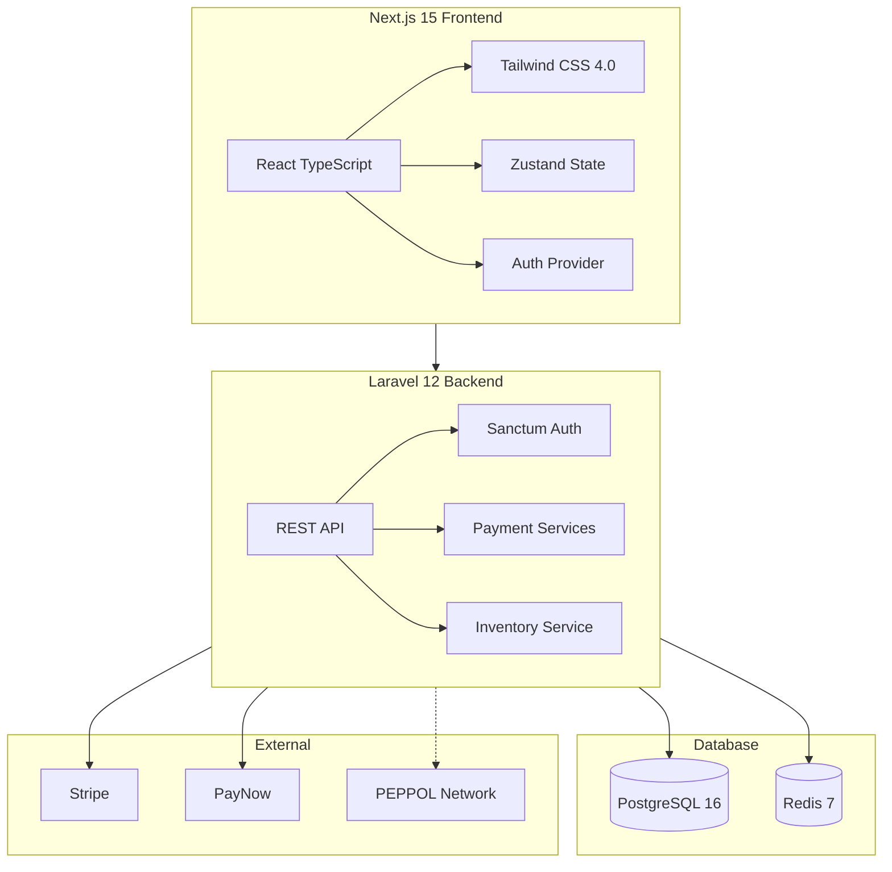

# ☕ Morning Brew Collective

<div align="center">

**Singapore's Authentic Kopitiam Experience Since 1973**  
*Heritage, Digitized. Tradition, Perfected.*

[](https://github.com/your-repo/morning-brew-collective)
[](https://github.com/your-repo/morning-brew-collective)
[](https://www.typescriptlang.org/)
[](https://laravel.com/docs/12.x)
[](https://nextjs.org)
[](https://tailwindcss.com)
[](https://www.w3.org/WAI/WCAG2AAA-Conformance)

[Live Demo](https://morningbrew.collective) • [Documentation](#-documentation) • [Quick Start](#-quick-start) • [Contributing](#-contributing)

</div>

---

## 🌅 What is Morning Brew Collective?

Morning Brew Collective is a **Singapore-first headless e-commerce platform** that digitizes a heritage 1970s kopitiam. This isn't just a website—it's a **transactionally robust system** built with meticulous attention to detail, combining nostalgic aesthetics with enterprise-grade capabilities.

<div align="center">

| 🎨 Design | 💳 Payments | 🔐 Security | 📜 Compliance |
|-----------|-------------|-------------|---------------|
| Retro-Futuristic UI | Stripe + PayNow | Enterprise Auth | GST 9% Precision |
| WCAG AAA Accessibility | Real-time Inventory | Rate Limiting | PDPA Compliant |
| Micro-animations | Webhook-driven | Audit Logging | InvoiceNow Ready |

</div>

### Why Morning Brew?

> *"We don't build generic e-commerce. We craft digital experiences that honor heritage."*

- **🏛️ Heritage-First Design:** Every pixel serves the "Sunrise at the Kopitiam" narrative
- **💰 Financial Precision:** `DECIMAL(10,4)` for Singapore GST—no rounding errors, ever
- **🔒 Enterprise Security:** Laravel Sanctum with RBAC, rate limiting, audit logging
- **🇸🇬 Singapore Compliant:** GST, PDPA, PayNow, InvoiceNow (PEPPOL BIS 3.0)

---

## 📸 Screenshots

<div align="center">

| Landing Page | Menu Catalog | Payment Flow |
|--------------|--------------|--------------|
| *Retro-futuristic hero* | *Heritage menu display* | *Stripe + PayNow* |

</div>

---

## 🏗️ Architecture



### Technology Stack

| Layer | Technology | Purpose |
|-------|------------|---------|
| **Frontend** | Next.js 15, TypeScript, Tailwind CSS 4.0 | App Router, Type Safety, CSS-first Design |
| **State** | Zustand | Cart, Auth, Filters, Toast |
| **Backend** | Laravel 12, PHP 8.3 | API-first, Sanctum Auth |
| **Database** | PostgreSQL 16 | DECIMAL(10,4) precision |
| **Cache** | Redis 7 | Inventory locks, Session |
| **Payments** | Stripe, PayNow | Cards, QR codes |
| **Invoicing** | InvoiceNow | PEPPOL UBL 2.1 |

---

## ✨ Features

### 🛒 E-Commerce

- **Product Catalog** - Heritage menu with categories and variants
- **Cart System** - Persistent cart with Zustand + localStorage
- **Checkout Flow** - Multi-step with real-time validation
- **Order Management** - Full CRUD with status tracking

### 💳 Payments

- **Stripe Integration** - Card payments with 3D Secure
- **PayNow QR Codes** - Singapore's local payment method
- **Webhook-Driven** - Accurate real-time status updates
- **Refund Support** - Full and partial refunds

### 🔐 Authentication & Security

- **Token-Based Auth** - Laravel Sanctum SPA authentication
- **Role-Based Access** - Customer and Admin roles
- **Rate Limiting** - 5 login/min, 3 register/min per IP
- **Password Policy** - 8+ chars, mixed case, numbers, symbols
- **Audit Logging** - PDPA-compliant pseudonymized logs
- **Protected Routes** - Frontend HOC + Backend middleware

### 📊 Admin Dashboard

- **Order Management** - View, update, fulfill orders
- **Inventory Control** - Stock levels with two-phase reservation
- **Invoice Generation** - InvoiceNow (PEPPOL) XML export
- **Analytics** - Sales and performance metrics

### 🇸🇬 Singapore Compliance

- **GST Precision** - 9% calculated with 4 decimal places
- **PDPA** - Consent tracking, pseudonymization, audit trail
- **PayNow** - Native QR code integration
- **InvoiceNow** - PEPPOL BIS Billing 3.0 compliant

---

## 🚀 Quick Start

### Prerequisites

- Docker Desktop (Mac/Windows) or Docker Engine (Linux)
- Node.js 22+
- PHP 8.3+ (for local development)
- Stripe account (for payment testing)

### Installation

```bash
# 1. Clone the repository
git clone https://github.com/your-org/morning-brew-collective.git
cd morning-brew-collective

# 2. Configure environment
cp backend/.env.example backend/.env
cp frontend/.env.example frontend/.env

# 3. Install dependencies
make install

# 4. Start all services
make up

# 5. Wait for services (60 seconds) then access:
# 🛒 Shop: http://localhost:3000
# 🔧 API:  http://localhost:8000
# 📧 Mail: http://localhost:8025
```

### Verify Installation

```bash
# Check API health
curl http://localhost:8000/api/v1/health

# Run backend tests
make test-backend

# Check TypeScript
cd frontend && npm run typecheck

# Build frontend
npm run build
```

---

## 📁 Project Structure

```
authentic-kopitiam/
├── backend/                    # Laravel 12 API
│   ├── app/
│   │   ├── Http/Controllers/   # REST endpoints
│   │   │   └── Api/
│   │   │       ├── AuthController.php
│   │   │       ├── OrderController.php
│   │   │       ├── PaymentController.php
│   │   │       └── ...
│   │   ├── Models/             # Eloquent models
│   │   ├── Services/           # Business logic
│   │   │   ├── PaymentService.php
│   │   │   ├── AuthAuditService.php
│   │   │   └── ...
│   │   └── Middleware/
│   │       └── EnsureUserIsAdmin.php
│   ├── database/migrations/    # DB schema
│   └── tests/                  # PHPUnit tests
│
├── frontend/                   # Next.js 15 App
│   ├── src/
│   │   ├── app/                # App Router
│   │   │   ├── (shop)/         # Customer routes
│   │   │   ├── (dashboard)/    # Admin routes
│   │   │   ├── (auth)/         # Login/Register
│   │   │   └── unauthorized/   # 403 page
│   │   ├── components/
│   │   │   ├── ui/             # Design system (retro-*)
│   │   │   ├── payment/        # Payment UI
│   │   │   ├── auth/           # Auth components
│   │   │   └── admin/          # Dashboard components
│   │   ├── store/              # Zustand stores
│   │   │   ├── auth-store.ts
│   │   │   ├── cart-store.ts
│   │   │   └── ...
│   │   └── styles/             # CSS design system
│   └── tests/                  # Vitest + Playwright
│
├── docker-compose.yml          # Development stack
├── Makefile                    # Development commands
└── README.md                   # You are here
```

---

## 🎨 Design System: "Sunrise at the Kopitiam"

Our design system captures the warmth of a 1970s Singapore kopitiam at dawn.

### Color Palette

| Token | Value | Usage |
|-------|-------|-------|
| `cream-white` | `#FAF7F0` | Background, cards |
| `espresso-dark` | `#2C1810` | Text, headings |
| `terracotta-warm` | `#C4704D` | Primary actions |
| `sunrise-amber` | `#E8A75A` | Accents, highlights |
| `honey-light` | `#F5E6C8` | Secondary backgrounds |

### Typography

- **Display:** Fraunces (Variable) - Headlines, hero text
- **Body:** DM Sans - Paragraphs, UI text

### Components

All UI components use `retro-*` wrappers for consistent styling:

```tsx
import { RetroButton } from '@/components/ui/retro-button';
import { RetroDialog } from '@/components/ui/retro-dialog';
import { RetroDropdown } from '@/components/ui/retro-dropdown';
```

> **Important:** Never use raw Shadcn/Radix components. Always use `retro-*` wrappers.

---

## 🔒 Authentication

### Routes

| Endpoint | Method | Protection | Purpose |
|----------|--------|------------|---------|
| `/api/v1/register` | POST | Rate limited | User registration |
| `/api/v1/login` | POST | Rate limited | User login |
| `/api/v1/logout` | POST | Auth required | Logout |
| `/api/v1/me` | GET | Auth required | Current user |
| `/api/v1/admin/*` | ALL | Admin only | Admin operations |

### Security Features

- **Token Expiration:** 24 hours (configurable)
- **Rate Limiting:** Protects against brute force
- **Audit Logging:** All auth events logged with pseudonymization
- **Single Session:** New login revokes previous tokens

---

## 📚 Documentation

| Document | Purpose |
|----------|---------|
| [CLAUDE.md](./CLAUDE.md) | Agent initialization handbook |
| [Project Architecture](./Project_Architecture_Document.md) | System architecture details |
| [Tailwind Debug Guide](./docs/TAILWIND_V4_VISUAL_DEBUGGING_GUIDE.md) | CSS troubleshooting |
| [Payment API](./backend/docs/PAYMENT_API.md) | API specifications |

---

## 🧪 Testing

### Backend Tests

```bash
# Run all backend tests
make test-backend

# Run specific test
docker compose exec backend php artisan test --filter=OrderControllerTest
```

### Frontend Tests

```bash
# TypeScript check
cd frontend && npm run typecheck

# Build verification
npm run build

# Unit tests (Vitest)
npm run test

# E2E tests (Playwright)
npm run test:e2e
```

---

## 🧑‍💻 Development Commands

| Command | Description |
|---------|-------------|
| `make up` | Start all Docker containers |
| `make down` | Stop all containers |
| `make logs` | Tail logs for all services |
| `make install` | Install all dependencies |
| `make migrate` | Run database migrations |
| `make test` | Run all tests |
| `make test-backend` | Run backend tests only |
| `make shell-backend` | Bash into Laravel container |
| `make shell-frontend` | Shell into Next.js container |

---

## 🚢 Deployment

### Environment Variables

```env
# Backend (.env)
APP_ENV=production
STRIPE_SECRET_KEY=sk_live_xxx
STRIPE_WEBHOOK_SECRET=whsec_xxx
PAYNOW_UEN=your-uen

# Frontend (.env)
NEXT_PUBLIC_API_URL=https://api.morningbrew.collective
NEXT_PUBLIC_STRIPE_KEY=pk_live_xxx
```

### Checklist

- [ ] Configure production environment variables
- [ ] Set up SSL/TLS certificates
- [ ] Configure Redis for persistent queues
- [ ] Run `make migrate` in deployment pipeline
- [ ] Verify webhook endpoints are accessible

---

## 🤝 Contributing

We welcome contributions! Please read our guidelines:

1. **Fork** the repository
2. **Create** a feature branch (`git checkout -b feature/amazing-feature`)
3. **Follow** the design system (use `retro-*` components)
4. **Write** tests for new features
5. **Run** `make test` before committing
6. **Submit** a pull request

### Code Standards

- TypeScript strict mode enabled
- ESLint + Prettier for formatting
- Conventional commits (`feat:`, `fix:`, `docs:`)
- DECIMAL(10,4) for all financial values

---

## 📄 License

Copyright © 2026 Morning Brew Collective. All rights reserved.

---

<div align="center">

**Built with ☕ in Singapore**

[](https://github.com/your-repo/morning-brew-collective)
[](https://github.com/your-repo/morning-brew-collective)
[](https://github.com/your-repo/morning-brew-collective)

*Phase 9 Complete: Authentication & Security*

</div>
